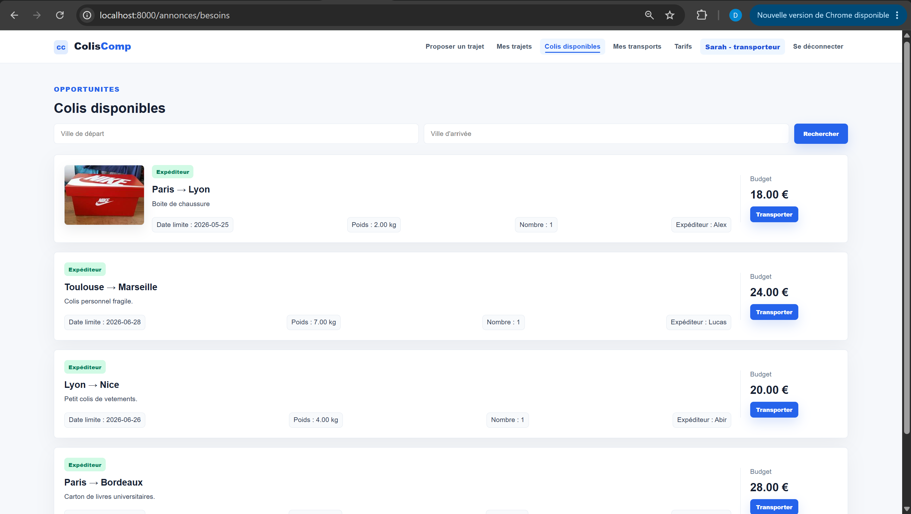

# ColisComp

Plateforme collaborative de transport de colis développée avec Symfony, Twig et MySQL.

## Aperçu du projet

ColisComp permet aux utilisateurs :

- d’envoyer des colis via des transporteurs particuliers,
- de publier des trajets disponibles,
- de gérer les transactions et les livraisons,
- d’échanger entre expéditeurs et transporteurs,
- de suivre leurs envois depuis un tableau de bord moderne.

Le projet propose deux rôles :

- Expéditeur
- Transporteur

---

## Fonctionnalités principales

### Authentification

- Inscription utilisateur
- Connexion sécurisée
- Gestion des rôles

### Expéditeur

- Publication de colis
- Recherche de transporteurs
- Suivi des envois
- Gestion des transactions

### Transporteur

- Publication de trajets
- Consultation des colis disponibles
- Acceptation des demandes
- Gestion des transports

### Interface

- Dashboard moderne
- Interface responsive
- Navigation dynamique
- Notifications utilisateur

---

## Technologies utilisées

- Symfony
- PHP
- Twig
- MySQL
- Doctrine DBAL
- HTML / CSS
- Docker

---

## Installation

### 1. Cloner le projet

```bash
git clone <repo-url>
```

### 2. Installer les dépendances

```bash
composer install
```

### 3. Configurer la base de données

Importer le fichier SQL :

```text
database/coliscomp.sql
```

Configurer le fichier `.env` :

```env
DATABASE_URL="mysql://root:@127.0.0.1:3306/coliscomp?serverVersion=mariadb-10.4.32&charset=utf8mb4"
```

### 4. Lancer le projet

Avec Symfony :

```bash
symfony server:start
```

ou avec PHP :

```bash
php -S localhost:8000 -t public
```

Puis ouvrir :

```text
http://localhost:8000
```

---

## Captures d’écran

### Connexion


### Inscription


### Tableau de bord expéditeur


### Tableau de bord transporteur


### Publication d’un colis


### Publication d’un trajet


### Colis disponibles



### Transactions


---

## Améliorations réalisées

- Migration vers Symfony
- Architecture MVC propre
- Templates Twig
- Interface modernisée
- Gestion des utilisateurs
- Upload d’image
- Recherche d’annonces
- Base SQL intégrée

---

## Auteur

Projet réalisé par Dounia Lallouche.