# ColisComp

Plateforme collaborative de transport de colis développée avec Symfony, Twig, MySQL et Stripe Checkout.

## Aperçu du projet

ColisComp permet aux utilisateurs :

- d’envoyer des colis via des transporteurs particuliers,
- de publier des trajets disponibles,
- de gérer les transactions, les paiements en ligne et les livraisons,
- d’échanger entre expéditeurs et transporteurs,
- de suivre leurs envois depuis une interface moderne.

Le projet propose deux rôles :

- Expéditeur
- Transporteur

---

## Fonctionnalités principales

### Authentification

- Inscription utilisateur
- Connexion sécurisée
- Gestion des rôles

### Expéditeur

- Publication de colis
- Recherche de transporteurs
- Suivi des envois
- Gestion des transactions et paiements en ligne

### Transporteur

- Publication de trajets
- Consultation des colis disponibles
- Acceptation des demandes
- Gestion des transports

### Paiement

- Intégration du paiement en ligne avec Stripe Checkout
- Utilisation de l’environnement de test Stripe
- Création d’une page de paiement dédiée
- Gestion des transactions liées aux livraisons
- Suivi du statut des paiements

### Interface

- Dashboard moderne
- Interface responsive
- Navigation dynamique
- Notifications utilisateur

---

## Technologies utilisées

- Symfony
- PHP
- Twig
- MySQL
- Doctrine DBAL
- Stripe Checkout
- HTML / CSS

---

## Installation

### 1. Cloner le projet

```bash
git clone https://github.com/dounia-lall/coliscomp-symfony.git
```

### 2. Installer les dépendances

```bash
composer install
```

### 3. Configurer la base de données

Importer le fichier SQL :

```text
database/coliscomp.sql
```

Configurer le fichier `.env` :

```env
DATABASE_URL="mysql://root:@127.0.0.1:3306/coliscomp?serverVersion=mariadb-10.4.32&charset=utf8mb4"
```

### 4. Lancer le projet

Avec Symfony :

```bash
symfony server:start
```

ou avec PHP :

```bash
php -S localhost:8000 -t public
```

Puis ouvrir :

```text
http://localhost:8000
```

---

## Captures d’écran

### Connexion

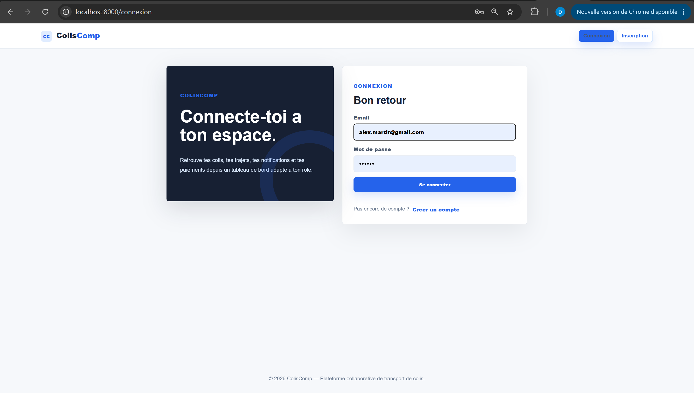

### Inscription

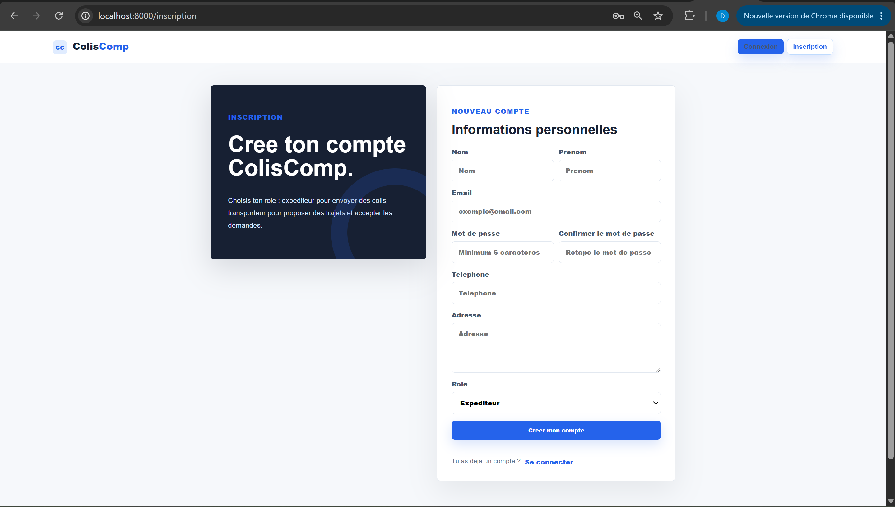

### Dashboard expéditeur

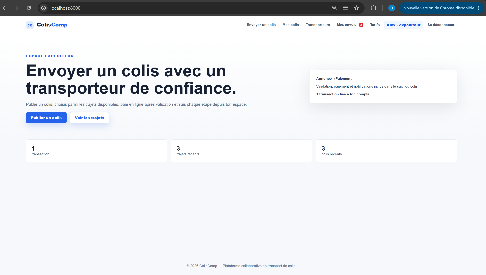

### Dashboard transporteur

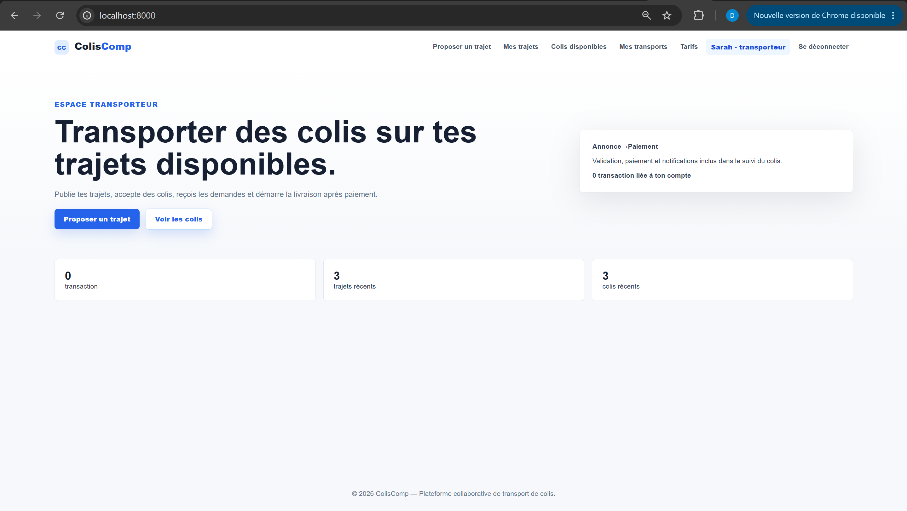

### Publier un colis

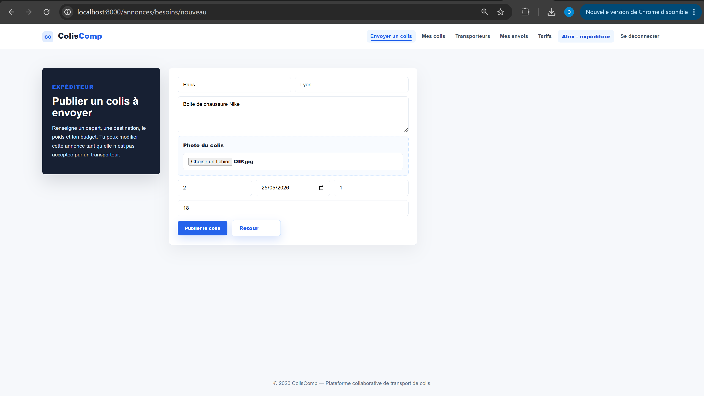

### Publier un trajet

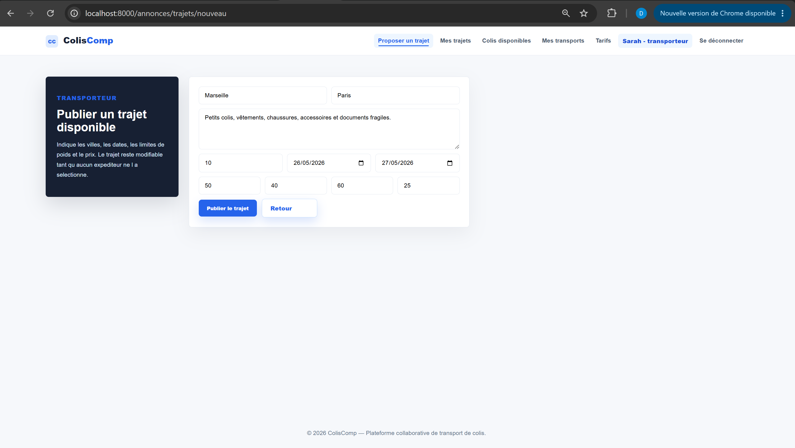

### Liste des colis

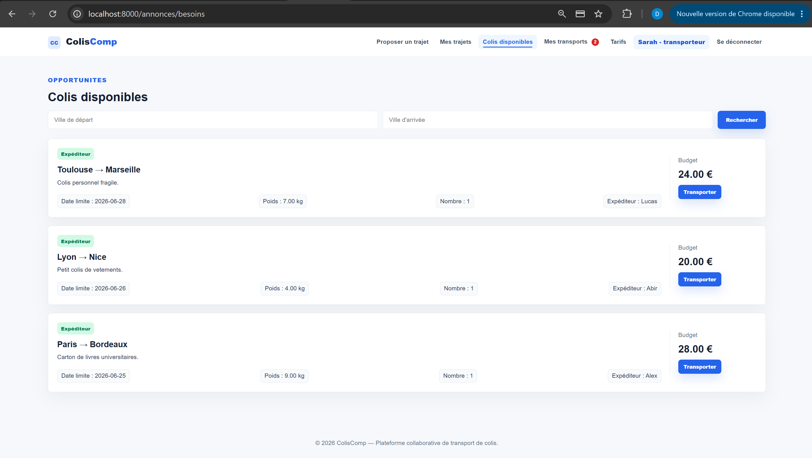

### Liste des transporteurs

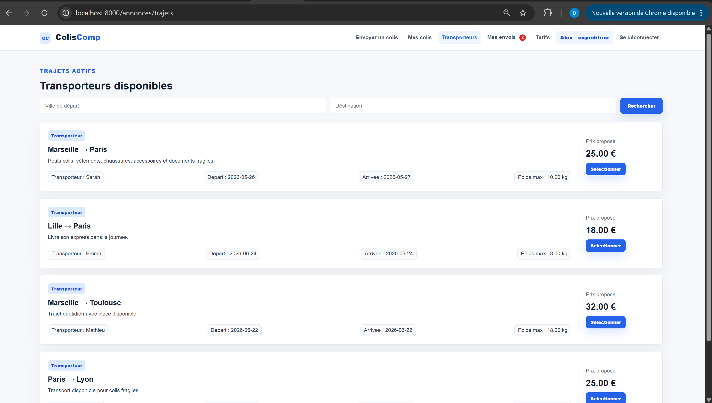

### Mes colis

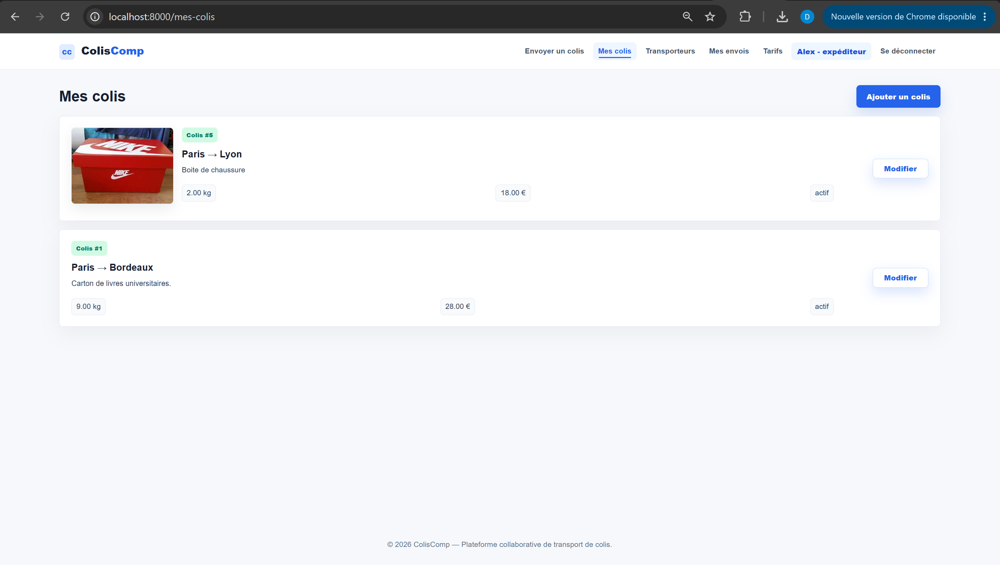

### Mes trajets

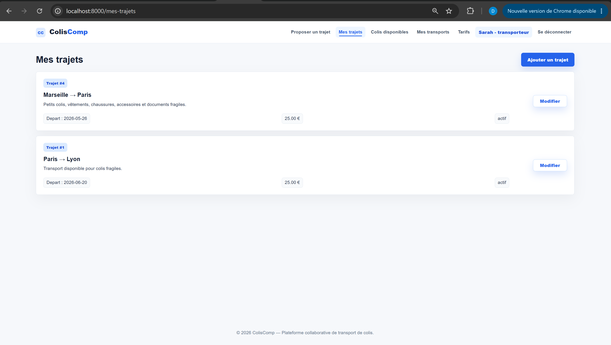

### Mes transports

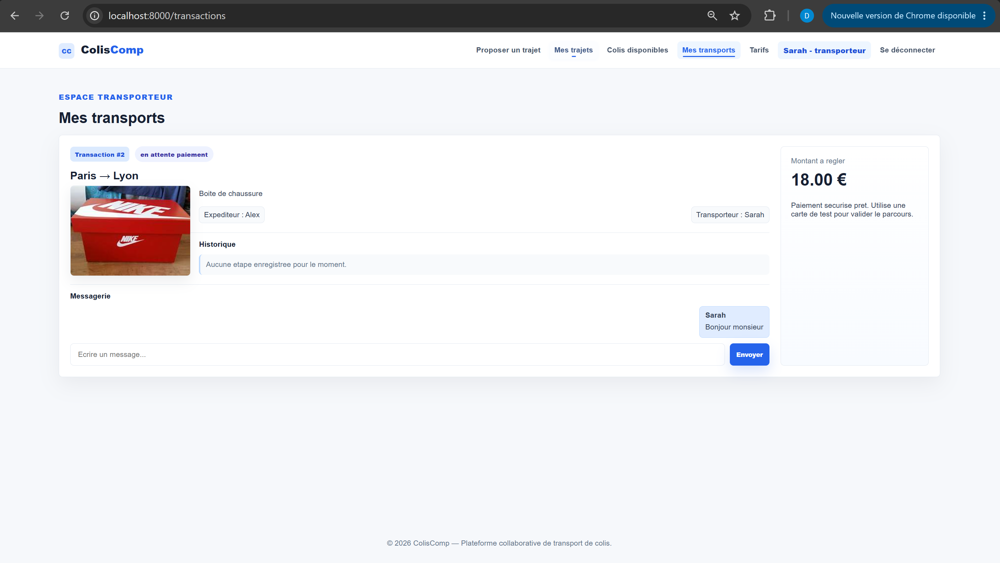

### Mes envois

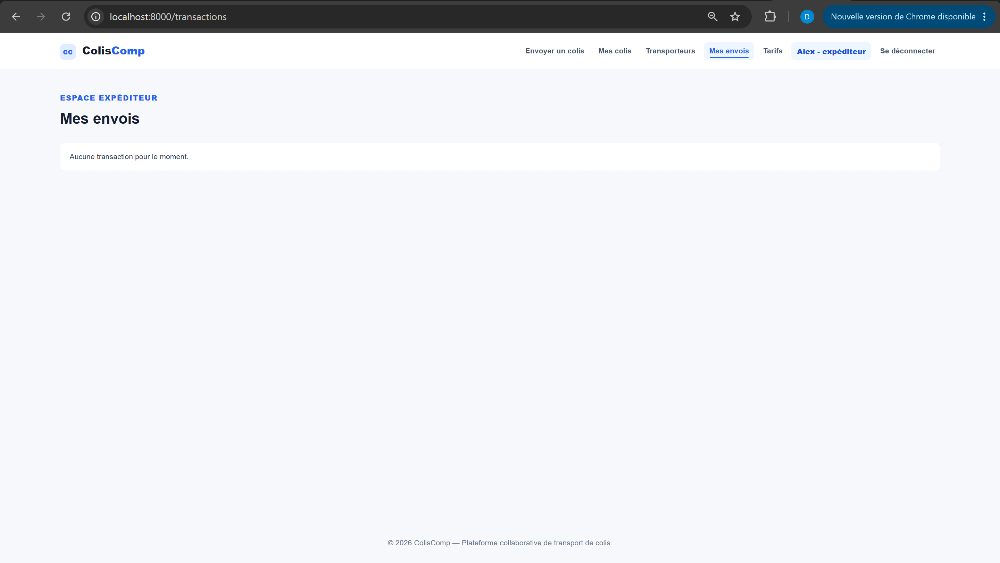

### Paiement

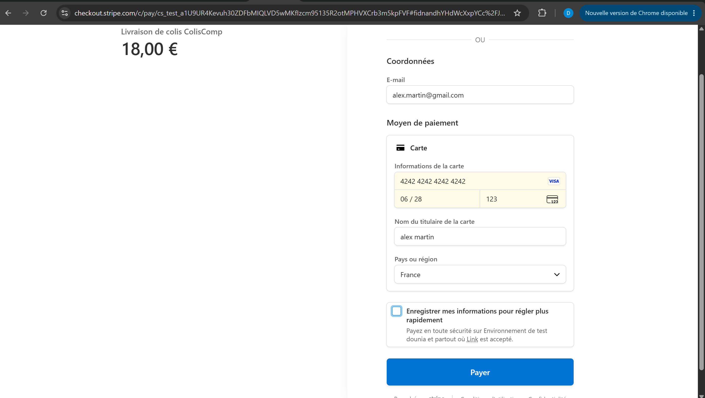

### Tarifs

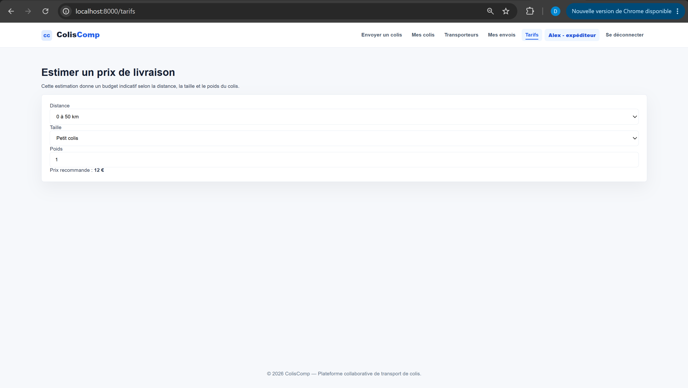

### Livraison terminée

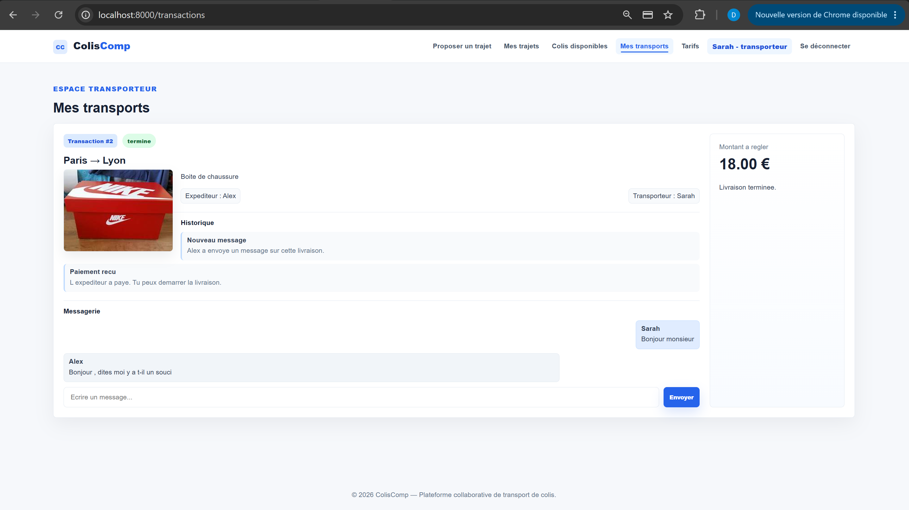

### Messagerie

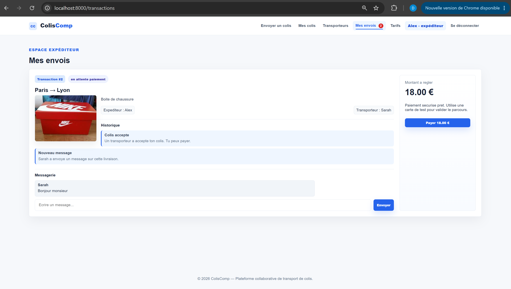

### Transport avec messages

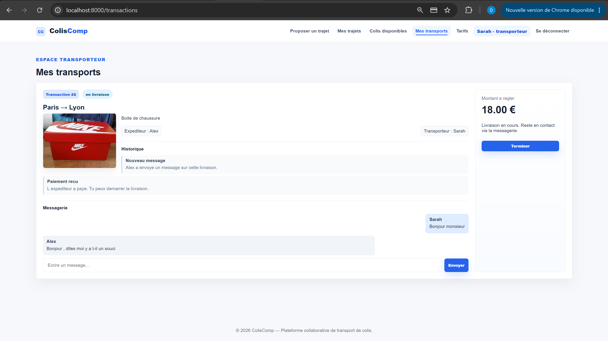

### Transporteurs disponibles

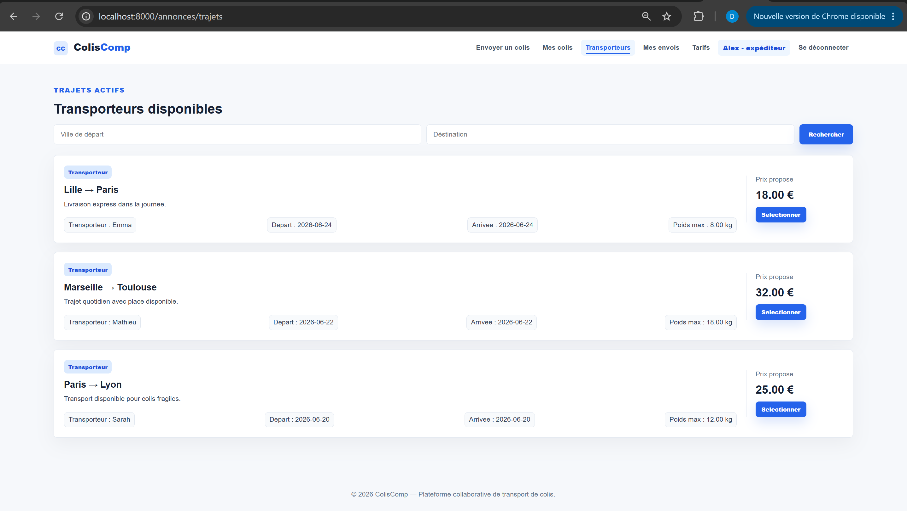

---

## Compétences développées

Ce projet m’a permis de développer mes compétences en développement web backend et fullstack :

- Symfony
- Architecture MVC
- Templates Twig
- Gestion des utilisateurs
- Authentification
- Intégration de base de données SQL
- Upload et gestion d’images
- Recherche et filtrage d’annonces
- Intégration de paiement en ligne avec Stripe Checkout
- Développement d’interfaces web modernes

---

## Auteur

Projet réalisé par Dounia Lallouche.
